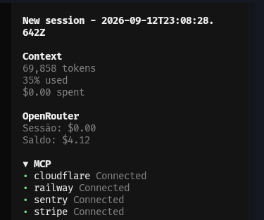

# opencode-openrouter-costs

[English](./README.md) | [Português (BR)](./README.pt-BR.md)

Plugin TUI para OpenCode — widget no painel lateral mostrando gasto da sessão e saldo da conta OpenRouter.

## Instalar

```sh
# Do npm (recomendado)
npx opencode-openrouter-costs

# Do código-fonte (GitHub)
npx github:mhenrique94/opencode-openrouter-costs
```

O instalador pergunta o idioma preferido (Inglês ou Português) na primeira execução.
Todo o output subsequente — instruções do instalador e o próprio widget — usa o idioma escolhido.

## O que faz

Adiciona um widget compacto no sidebar do OpenCode (acima de "Servidor MCP"):



- **Sessão** — gasto da sessão atual (reseta ao criar nova sessão)
- **Saldo** — crédito restante da conta OpenRouter

## Requisitos

- OpenCode >= 1.18.30
- Provider OpenRouter configurado (via `/models` ou `OPENROUTER_API_KEY`)

## Desinstalar

```sh
npx opencode-openrouter-costs --remove
```

## Idioma

O widget suporta Inglês e Português (BR). O idioma é escolhido no momento da instalação
e salvo em `~/.config/opencode/openrouter-cost.json`. Para trocar depois, execute o
instalador novamente ou edite o arquivo de config diretamente:

```json
{"lang": "pt"}
```

Valores válidos: `"en"` ou `"pt"`.

## Licença

MIT
